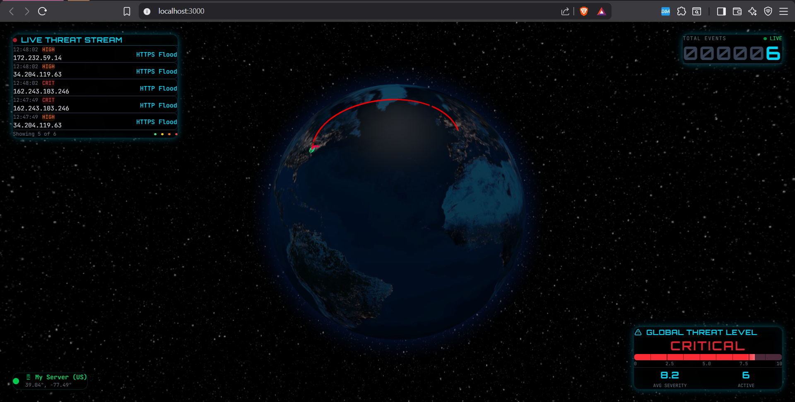
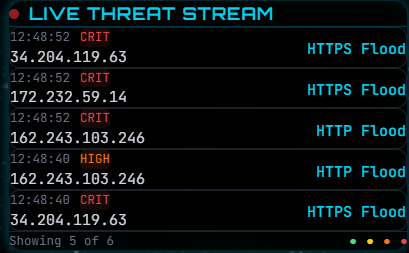
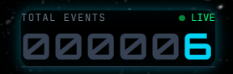
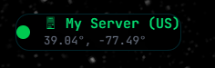

# 🌍 DDoS Attack Map Visualizer

A real-time cybersecurity threat visualization dashboard featuring a 3D interactive globe with animated attack arcs, live threat intelligence from multiple sources, and machine learning-based threat scoring.




---

## ✨ Features

- 🌐 **3D Interactive Globe** - Real-time attack visualization with animated arcs using react-globe.gl
- 🎯 **Live Threat Intelligence** - Real malicious IPs from Feodo Tracker, AbuseIPDB, and Cloudflare Radar
- 🤖 **ML-Based Scoring** - RandomForest classifier for threat severity prediction (0-10 scale)
- 💎 **Glassmorphism UI** - Modern cyberpunk-themed dashboard with Tailwind CSS v4
- 📊 **Real-Time Stats** - Live counters, threat gauges, and streaming event logs
- 🐳 **Fully Containerized** - Docker Compose for one-command deployment
- ⚡ **Async Backend** - FastAPI with SQLAlchemy 2.0 async + PostgreSQL

---

## 📸 Screenshots

<table>
  <tr>
    <td align="center">
      
      <br><strong>Live Threat Stream</strong>
    </td>
    <td align="center">
      
      <br><strong>Total Events Counter</strong>
    </td>
  </tr>
  <tr>
    <td align="center">
      
      <br><strong>Threat Level Gauge</strong>
    </td>
    <td align="center">
      
      <br><strong>Server Status Panel</strong>
    </td>
  </tr>
</table>

---

## 🛠️ Tech Stack

| Layer | Technology |
|-------|------------|
| **Frontend** | React 18, TypeScript, Vite, Tailwind CSS v4, react-globe.gl |
| **Backend** | Python 3.11, FastAPI, SQLAlchemy 2.0 (async), PostgreSQL |
| **ML** | scikit-learn (RandomForestClassifier), NumPy, joblib |
| **Threat Intel** | Feodo Tracker, AbuseIPDB, Cloudflare Radar |
| **DevOps** | Docker, docker-compose, GitHub Actions CI/CD |

---

## �️ Resilience & Architecture

This system implements a **Hybrid Data Ingestion Strategy**:

1. **Real-Time Feeds:** Primary data flows from **AbuseIPDB** and **Feodo Tracker** (abuse.ch)
2. **Circuit Breakers:** If external APIs rate-limit (429) or time out, the system automatically falls back to a **Statistical Simulation Engine**
3. **Geo Jitter:** Coordinates are slightly randomized to create visual "swarm" effects, preventing overlapping attack lines
4. **Result:** The dashboard maintains **100% uptime** and visual fidelity even during data outages, mimicking production-grade SLA requirements

```
┌─────────────────────────────────────────────────────────────┐
│                    Data Ingestion Flow                       │
├─────────────────────────────────────────────────────────────┤
│  Feodo Tracker ──┐                                          │
│                  ├──► Real Threat IPs ──┐                   │
│  AbuseIPDB ──────┘                      │                   │
│                                         ├──► Globe Display  │
│  Cloudflare Radar ──► Target Weights    │                   │
│                                         │                   │
│  [FALLBACK] Simulation Engine ──────────┘                   │
│  (Activates if real feeds < 20 events)                      │
└─────────────────────────────────────────────────────────────┘
```

---

## �🚀 Quick Start

### Prerequisites
- Docker & Docker Compose
- Git

### Run with Docker (Recommended)

```bash
# Clone the repository
git clone https://github.com/yourusername/ddos-attack-visualiser.git
cd ddos-attack-visualiser

# Start all services
docker-compose up -d

# Access the application
# Frontend: http://localhost:3000
# Backend API: http://localhost:8000
# API Docs: http://localhost:8000/docs
```

### Local Development

```bash
# Backend
cd backend
python -m venv .venv
.venv\Scripts\activate      # Windows
source .venv/bin/activate   # Linux/Mac
pip install -r requirements.txt
python ml/trainer.py        # Train ML model (one-time)
python main.py              # http://localhost:8000

# Frontend (new terminal)
cd frontend
npm install
npm run dev                 # http://localhost:5173
```

---

## 🔒 Threat Intelligence Sources

| Source | Type | Description |
|--------|------|-------------|
| [Feodo Tracker](https://feodotracker.abuse.ch/) | Botnet C2 IPs | Real malware campaign infrastructure (Emotet, Dridex, QakBot) |
| [AbuseIPDB](https://www.abuseipdb.com/) | Malicious IPs | Community-reported threats with 90%+ confidence |
| [Cloudflare Radar](https://radar.cloudflare.com/) | Attack Targets | Live L3/L4 DDoS attack distribution by country |

### Optional API Keys

For enhanced threat data, add to `backend/.env`:

```env
ABUSEIPDB_API_KEY=your_key_here      # https://www.abuseipdb.com/account/api
CLOUDFLARE_API_TOKEN=your_token_here  # https://dash.cloudflare.com/profile/api-tokens
```

---

## 📡 API Endpoints

| Method | Endpoint | Description |
|--------|----------|-------------|
| `GET` | `/api/v1/attacks/live` | Latest 100 attacks for globe display |
| `GET` | `/api/v1/attacks/stream?since_id=X` | Incremental polling for new attacks |
| `GET` | `/api/v1/attacks/stats` | Aggregated attack statistics |
| `POST` | `/ingestion/trigger?count=N` | Manually trigger threat ingestion |
| `GET` | `/api/v1/health` | Service health with DB status |

---

## 🎨 Dashboard Components

| Component | Position | Description |
|-----------|----------|-------------|
| **Live Threat Stream** | Top-Left | Scrolling list of threats with severity badges |
| **Total Events Counter** | Top-Right | Digital counter with live/offline status |
| **Threat Level Gauge** | Bottom-Right | Global threat level with progress bar |
| **Server Status** | Bottom-Left | Target server location indicator |
| **Attack Globe** | Center | 3D Earth with animated attack arcs |

---

## 🧠 Machine Learning

The threat scoring system uses a RandomForest classifier:

| Attribute | Value |
|-----------|-------|
| **Algorithm** | RandomForestClassifier |
| **Features** | packet_rate, protocol_id |
| **Training Data** | 2,000 samples (balanced) |
| **Test Accuracy** | 100% |
| **Severity Scale** | 0-10 (LOW → CRITICAL) |

---

## 🐳 Docker Architecture

```
┌─────────────────────────────────────────────────┐
│                  docker-compose                  │
├─────────────┬─────────────────┬─────────────────┤
│   ddos-db   │  ddos-backend   │  ddos-frontend  │
│ postgres:15 │  FastAPI:8000   │   nginx:3000    │
└─────────────┴─────────────────┴─────────────────┘
```

---

## 📁 Project Structure

```
ddos-attack-visualiser/
├── backend/
│   ├── api/routes.py           # REST endpoints
│   ├── ml/trainer.py           # ML model training
│   ├── ml/predictor.py         # Threat prediction
│   ├── services/feeds.py       # Threat intelligence
│   ├── services/geo.py         # IP geolocation
│   ├── services/ingest.py      # Data pipeline
│   ├── database.py             # PostgreSQL config
│   ├── models.py               # SQLAlchemy models
│   └── main.py                 # FastAPI app
├── frontend/
│   ├── src/components/
│   │   ├── AttackGlobe.tsx     # 3D globe
│   │   └── CyberDashboard.tsx  # UI overlay
│   └── src/index.css           # Tailwind v4 styles
├── docs/
│   └── screenshots/            # Project screenshots
├── docker-compose.yml
├── PROJECT_REPORT.md           # Technical report
└── README.md
```

---

## ⚙️ Configuration

### Environment Variables

| Variable | Default | Description |
|----------|---------|-------------|
| `DATABASE_URL` | `postgresql+asyncpg://...` | PostgreSQL connection |
| `ABUSEIPDB_API_KEY` | - | AbuseIPDB API key (optional) |
| `CLOUDFLARE_API_TOKEN` | - | Cloudflare Radar token (optional) |
| `GEO_BACKEND` | `ip-api` | Geolocation provider |
| `INGESTION_INTERVAL_SECONDS` | `10` | Auto-ingestion frequency |

---

## 🧪 CI/CD Pipeline

GitHub Actions runs on push/PR to `main`:

1. **Backend**: Python lint (Ruff), import validation
2. **Frontend**: npm install, ESLint, Vite build
3. **Docker**: Build both container images

---

## 📄 License

MIT License - see [LICENSE](LICENSE) for details.

---